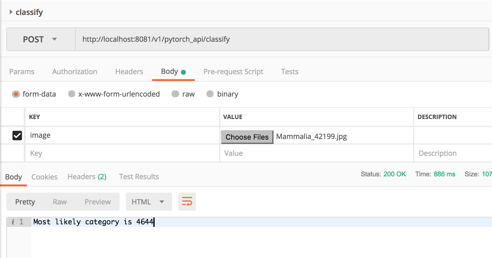

# PyTorch example

This example shows you how to deploy a PyTorch model via an AI for Earth container. In this example we use an image classification model trained on the iNaturalist 2018 dataset.


## Download the model

You can download an Inception v3 mdoel trained on the iNaturalist dataset from this [page](https://github.com/macaodha/inat_comp_2018), at the link in "we also provide a trained model that can be downloaded from _here_".

Place the downloaded model file [iNat_2018_InceptionV3.pth.tar](http://vision.caltech.edu/~macaodha/inat2018/iNat_2018_InceptionV3.pth.tar) in the `pytorch_api` folder, which will be copied to the Docker container (see the `COPY` commands in `Dockerfile`). There are other ways of accessing a model, such as placing it in a Azure blob storage container (a unit of blob storage, do not confuse with Docker _containers_) and mount that blob container.

Copy the file `inception.py` from the [inat_comp_2018](https://github.com/macaodha/inat_comp_2018) page and place it in the `pytorch_api` folder. We instantiate an Inception model in `pytorch_api/runserver.py` and load its weights from the model file.

## Modify Dockerfile

The `Dockerfile` in this example is a modified version of `base-py/Dockerfile`. The only modification is the additional commands to install `scipy` and `pytorch` packages.


## Modify `supervisord.conf`
If you changed the name of the destination folder in the Dockerfile where your API folder is copied to (here we used `/api/pytorch_api/`), remember to modify two places in `supervisord.conf` that uses the location of the API folder.


## Example service

This example API endpoint takes an input image, performs image classification on it, and returns a string that indicates the most likely category (a numerical label for each of the 8142 species in the iNat categories) the classifier has determined. You can look up what category these numerical labels correspond to from the file downloadable on the iNat 2018 GitHub page (see first point in the Updates section).

Build the docker image:
```
docker build . -t pytorch_example:1
```

Run image locally:
```
docker run -p 8081:80 "pytorch_example:1"
```

Run an instance of this image interactively and start bash to debug:
```
docker run -it pytorch_example:1 /bin/bash
```


## Testing and calling the service

Testing locally, the end point would be at

```
http://localhost:8081/v1/pytorch_api/classify
```

You can use a tool like Postman to test the end point:



