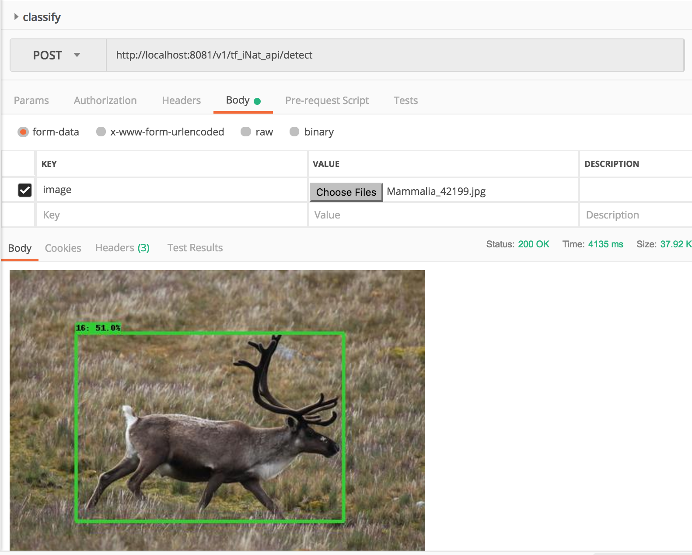

# TensorFlow example

This example shows you how to deploy a TensorFlow model via an AI for Earth container. In this example we use an object detection model trained on either the iNaturalist 2018 dataset or the COCO Dataset.

In this example, a user will send an image to the API via POST. It is a long-running API, so a task id will be returned when the endpoint is called. The API creates a SAS-keyed container within the API owner's Azure storage account.  The SAS URL is returned to the caller via a status update.


## Download the model

You can download one of the two models trained on the iNaturalist dataset on the [Tensorflow detection model zoo](https://github.com/tensorflow/models/blob/master/research/object_detection/g3doc/detection_model_zoo.md), in section _iNaturalist Species-trained models_. Download the resnet50 model (smaller) instead of resnet101 to have fewer memory usage issues during testing. The file is about 0.5 GB in size. After you download and unzip the folder, find `frozen_inference_graph.pb` and move this file to directory `tf_iNat_api` at the current directory.

In this example, we copy the entire directory `tf_iNat_api` to the Docker container (see the `COPY` commands in `Dockerfile`), but there are other ways of accessing a model, such as placing it in a Azure blob storage container (a unit of blob storage, do not confuse with Docker _containers_) and mount that blob container.

## Modify Dockerfile

The `Dockerfile` in this example is a modified version of `base-py/Dockerfile`. The only modification is the additional commands to install TensorFlow and Pillow packages.


## Modify `supervisord.conf`
If you changed the name of the destination folder in the Dockerfile where your API folder is copied to (here we used `/api/tf_iNat_api/`), remember to modify two places in `supervisord.conf` that uses the location of the API folder.


## Example service

This example API endpoint takes an input image, performs object detection on it, renders the bounding boxes on the image and returns that image. This is to demonstrate how to handle image input and output. Realistically you would probably return the coordinates of the bounding boxes and predicted categories in a json, rather than the rendered image.

Build the docker image:
```
docker build . -t tensorflow_example:1
```

Run image locally:
```
docker run -p 8081:80 "tensorflow_example:1"
```

Run an instance of this image interactively and start bash to debug:
```
docker run -it tensorflow_example:1 /bin/bash
```


## Testing and calling the service

Testing locally, the end point would be at

```
http://localhost:8081/v1/tf_iNat_api/detect
```

You can use a tool like Postman to test the end point:




