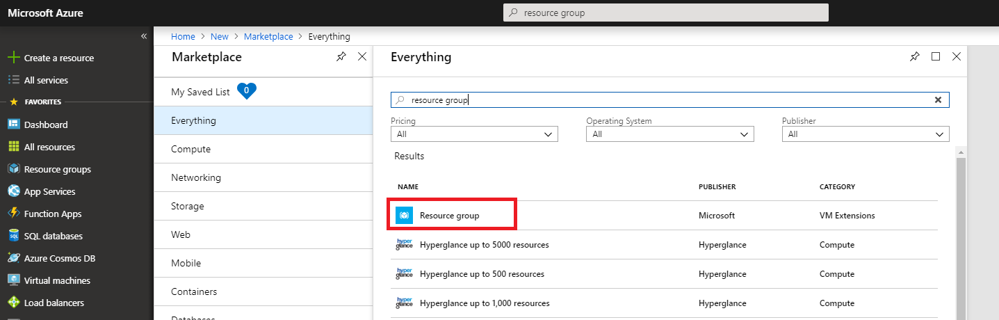
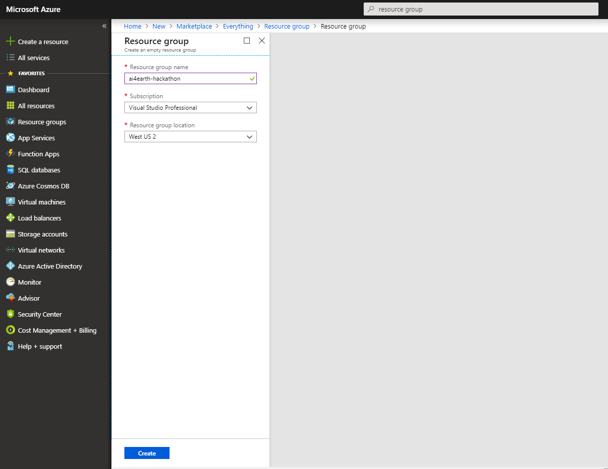
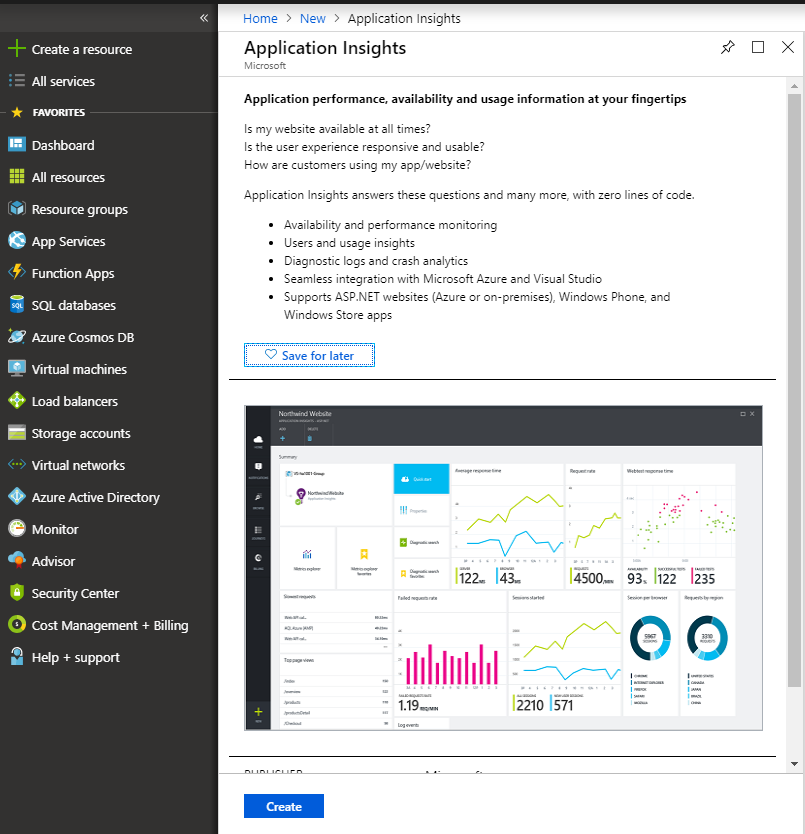
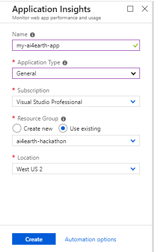
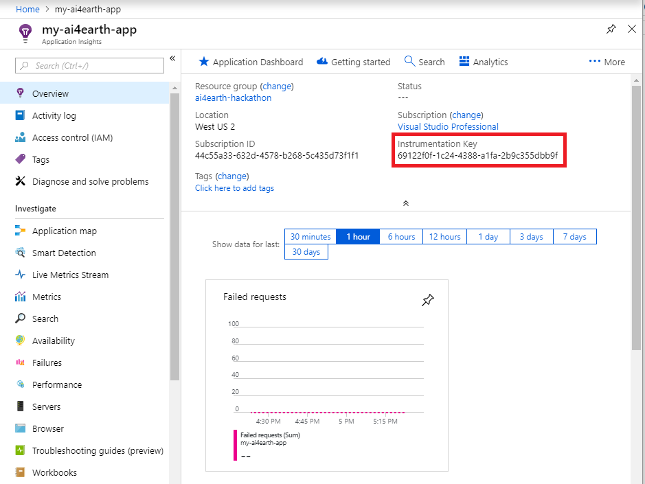
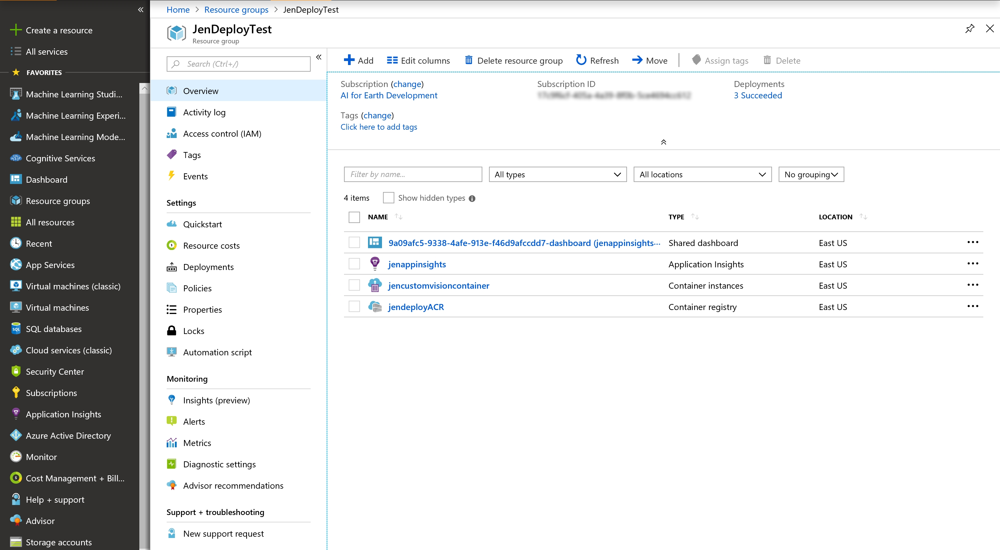

# AI for Earth - Quickstart Tutorial
This quickstart will walk you through turning a model into an API.  Starting with a trained model, we will containerize it, deploy it on Azure, and expose an endpoint to call the API.  We will leverage Docker containers, [Azure Application Insights](https://docs.microsoft.com/en-us/azure/application-insights/app-insights-overview), [Azure Container Registry](https://docs.microsoft.com/en-us/azure/container-registry/), and [Azure Container Instances](https://docs.microsoft.com/en-us/azure/container-instances/).  

We are assuming that you have a trained model that you want to expose as an API.  To begin, download or clone this repository to your local machine.  

## Create an Azure Resource Group
Throughout this quickstart tutorial, we recommend that you put all Azure resources created into a single new Resource Group.  This will organize these related resources together and make it easy to remove them as a single group.  

From the [Azure Portal](https://portal.azure.com), click Create a resource from the left menu. 


Search the Marketplace for "Resource Group".



Select the Resource group option and click Create. Use a descriptive Resource group name, such as "ai4earth-hackathon". For Resource group location, choose West US 2. Then click Create.



## Contents
  1. [Choose a base image or example](#Choose-a-base-image-or-example)
  2. [Insert code to call your model](#Insert-code-to-call-your-model)
  3. [Input handling](#Input-handling)
  4. [Output handling](#Output-handling)
  5. [Create AppInsights instrumentation keys (optional)](#Create-AppInsights-instrumentation-keys)
  6. [Install required packages](#Install-required-packages)
  7. [Set environment variables](#Set-environment-variables)
  8. [Build and run your image](#Build-and-run-your-image)
  9. [Make requests](#Make-requests)
  10. [Publish to Azure Container Registry](#Publish-to-Azure-Container-Registry)
  11. [Run your container in ACI](#Run-your-container-in-ACI)
  12. [FAQs](#FAQs)


## Machine Setup 
You will need an active Azure subscription as well as the following software installed.
+ [Azure CLI](https://docs.microsoft.com/en-us/cli/azure/install-azure-cli?view=azure-cli-latest)
+ [Docker Desktop](https://www.docker.com/products/docker-desktop)
+ [Postman](https://www.getpostman.com/apps)
+ Any [Python](https://www.python.org/downloads/)/[R](https://www.r-project.org/)/etc. environment you need to invoke your model

## Choose a base image or example
AI for Earth APIs are all built from an AI for Earth base image.  The [Repo Layout section of the README](https://github.com/Microsoft/AIforEarth-API-Development#repo-layout) details what each base image contains.  You may use a base image directly or start with an example.  The following sections will help you decide.

### Base images
- base-py
- base-r
- blob-py
- blob-r

### Examples
- Basic Python API (Sync and Async)
- Basic R API (Sync and Async)
- Blob Python API
- Synchronous Custom Vision API (Python) 
- Synchronous PyTorch API

In general, if you're using Python, you will want to use an image or example with the base-py or blob-py images.  If you are using R, you will want to use an image or example with the base-r or blob-r images.  The difference between them: the blob-* image contains everything that the cooresponding base-* image contains, plus additional support for mounting [Azure blob storage](https://docs.microsoft.com/en-us/azure/storage/blobs/storage-blobs-introduction).  This may be useful if you need to process (for example) a batch of images all at once; you can upload them all to Azure blob storage, the container in which your model is running can mount that storage, and access it like it is local storage.  

In addition to your language choice, you should think about whether your API call should be synchronous or asynchronous.  A synchronous API call will invoke your model, get results, and return immediately.  This is a good paradigm to use if you want to perform classification with your model on a single image, for example.  An asynchronous API call should be used for long-running tasks, like processing a whole folder of images, performing object detection on each image with your model, and storing the results.  

We have provided several examples that leverage these base images to make it easier for you to get started.  
- **base-py:** Start with this example if you are using Python and don't need Azure blob storage integration, and none of the below more specific examples are a good fit.  It contains both synchronous and asynchronous endpoints.  It is a great example to use for asynchronous, long-running API calls.  
- **base-r:** Start with this example if you are using R.  
- **blob-mount-py:** Start with this example if you are using Python and you need Azure blob storage integration.  
- **customvision-sample:** This example is a modification of the base-py example, using a synchronous API call to call a Custom Vision model.  It is a great example to use if you are using a Custom Vision model or if you are making a synchronous API call.  
- **pytorch:** This example is a modification of the base-py example, using a synchronous API call to call a PyTorch model.  It is a great example to use if you are using PyTorch or if you are making a synchronous API call.  
- **tensorflow:** This example is a modification of the base-py example, using an asynchronous API call to call a TensorFlow model.  It is a great example to use if you are using TensorFlow or if you are making an asynchronous API call.  

After you've chosen the example that best fits your scenario, make a copy of that directory, which you can use as your working directory in which you apply your changes.  

## Insert code to call your model
Next, in your new working directory, we need to update the example that you chose with code to call your specific model.  This should be done in the runserver.py file (if you are using a Python example) or the api_example.R file (if you are using an R example) in the my_api (or similarly named) subfolder.  

All examples contain the text "#INSERT_YOUR_MODEL_CALL_HERE".  This is intended to be a starting point to quickly get your API running with your model.  Simply adding your model will not perform necessary input checking, error handling, etc.  We strongly recommend that you implement these best practices as well.  

## Input handling
Your model has inputs and outputs.  For example, let's consider a classification model that takes an image and classifies its contents as one of multiple species of animal.  The input that you need to provide to this model is an image, and the output that you provide may be JSON-formatted text of the classifications and their confidence.  

Some examples of how to send parameters as inputs into your APIs follow.  

#### GET URL parameters
For GET operations, best practice dictates that a noun is used in the URL in the segment before the related parameter.  An echo example is as follows.

##### Python and Flask
```Python
@app.route(my_api_prefix + '/echo/<string:text>', methods=['GET'])
def echo(text):
    print(text)
```
##### R and Plumber
```R
#* @param text The text to echo back
#* @get /echo/<text>
GetProcessDataTaskStatus<-function(text){
  print(text)
}
```

#### POST body
For non-trivial parameters, retrieve parameters from the body sent as part of the request. [JSON](https://json.org/) is the preferred standard for API transmission. The following gives an example of sample input, followed by Python and R usage.

##### Sample Input
```JSON
{
    "container_uri": "https://myblobacct.blob.core.windows.net/user?st=2018-08-02T12%3A01%3A00Z&se=5200-08-03T12%3A01%3A00Z&sp=rwl&sv=2017-04-17&sr=c&sig=xxx",
    "run_id": "myrunid"
}
```

##### Python and Flask
```Python
from flask import Flask, request
import json

post_body = json.loads(request.data)

print(post_body['run_id'])
print(post_body['container_uri'])
```

##### R and Plumber
```R
library(jsonlite)

#* @post /process-data
ProcessDataAPI<-function(req, res){
  post_body <- req$postBody
  input_data <- fromJSON(post_body, simplifyDataFrame=TRUE)

  print(input_data$run_id)
  print(input_data$container_uri)
}
```

## Output handling
Then, you need to send back your model's results as output.  Two return types are important when dealing with hosted ML APIs: non-binary and binary.

#### Non-binary data
You may need to return non-binary data, like simple strings or numbers.  The preferred method to return non-binary data is to use JSON.

##### Python and Flask

```Python
import json
def post(self):
    ret = {}
    ret['run_id'] = myrunid   
    ret['container_uri'] = 'https://myblobacct.blob.core.windows.net/user?st=2018-08-02T12%3A01%3A00Z&se=5200-08-03T12%3A01%3A00Z&sp=rwl&sv=2017-04-17&sr=c&sig=xxx'

    return json.dumps(ret)   
```

##### R and Plumber
```R
ProcessDataAPI<-function(req, res){
  post_body <- req$postBody
  input_data <- fromJSON(post_body, simplifyDataFrame=TRUE)

  # Return JSON containing run_id and container_uri 
  data.frame(input_data$run_id, input_data$container_uri)
}
```

#### Binary data
You may also need to return binary data, like images.

##### Python and Flask

```Python
from io import BytesIO
import tifffile
from flask import send_file

ACCEPTED_CONTENT_TYPES = ['image/tiff', 'application/octet-stream']

if request.headers.get("Content-Type") in ACCEPTED_CONTENT_TYPES:
    tiff_file = tifffile.imread(BytesIO(request.data))
    # Do something with the tiff_file...
    prediction_stream = BytesIO()
    # Create your image to return...
    prediction_stream.seek(0)
    return send_file(prediction_stream)
```
## Create AppInsights instrumentation keys
[Application Insights](https://docs.microsoft.com/en-us/azure/application-insights/app-insights-overview) is an Azure service for application performance management.  We have integrated with Application Insights to provide advanced monitoring capabilities.  You will need to generate both an Instrumentation key and a Live Stream key to use in your application. 

- [Instrumentation key](https://docs.microsoft.com/en-us/azure/application-insights/app-insights-create-new-resource)

The instrumentation key is for general logging and tracing.  This is found under the "Properties" section for your Application Insights instance in the Azure portal. 
- [Live stream key](https://docs.microsoft.com/en-us/azure/application-insights/app-insights-live-stream#sdk-requirements)

The live stream key is used for traces and allows you to visualize a live stream of events within the Application Insights Azure Portal.

To generate these, first create a new instance of Application Insights from the [Azure portal](https://portal.azure.com) by clicking "Create a resource" from the left menu and searching for Application Insights. 



Click Create, then choose a name for your Application Insight resource. For Application Type, choose General from the drop-down menu. For Resource Group, select "Use existing" and choose the resource group that you created earlier. 



Once your AppInsights resource has successfully deployed, navigate to the resource from your home screen, and locate the Instrumentation Key. 



Next, create a live stream key as well.  
**Still unable to create a live stream key!**

Copy and store both of these keys in a safe place.   


### Edit LocalForwarder.config
If you are using a Python-based image and would like to take advantage of tracing metrics, you will need to modify the LocalForwarder.config file by adding your Application Insights instrumentation and live stream keys.  There are three areas where you need to add your keys (be sure to add the proper key in the right place as shown below - you will use your instrumentation key twice and your live metrics key once):
```Xml
  <OpenCensusToApplicationInsights>
    <InstrumentationKey>your_instrumentation_key_goes_here</InstrumentationKey>
  </OpenCensusToApplicationInsights>
  <ApplicationInsights>
    <LiveMetricsStreamInstrumentationKey>your_instrumentation_key_goes_here</LiveMetricsStreamInstrumentationKey>
    <LiveMetricsStreamAuthenticationApiKey>your_live_metrics_key_goes_here</LiveMetricsStreamAuthenticationApiKey>
    ...
  </ApplicationInsights>
```

## Install required packages
Now, let's look at the Dockerfile in your code.  Update the Dockerfile to install any required packages. There are several ways to install packages.  We cover popular ones here:
- pip
```Dockerfile
RUN /usr/local/envs/ai4e_py_api/bin/pip install grpcio opencensus
```
- Anaconda
```Dockerfile
RUN echo "source activate ai4e_py_api" >> ~/.bashrc \
    && conda install -c conda-forge -n ai4e_py_api numpy pandas
```

- apt-get
```Dockerfile
RUN apt-get install gfortran -y
```

- R packages
```Dockerfile
RUN R -e 'install.packages("rgeos"); library(rgeos)'
```
## Set environment variables
The service_settings.env file contains several environment variables that should be set for proper logging.  You will need to add your two Application Insights keys here as well.  Follow the instructions within the file.  
```Dockerfile
# Logging Variables ----------------------------------------------------
# All logging and metric collection flows through Application Insights
# Set the following env var to your AppInsights instrumentation key.
APPINSIGHTS_INSTRUMENTATIONKEY=
# Optional live metrics stream key
# https://docs.microsoft.com/en-us/azure/application-insights/app-insights-live-stream#sdk-requirements
APPINSIGHTS_LIVEMETRICSSTREAMAUTHENTICATIONAPIKEY=
# Location where AppInsights stores its data
LOCALAPPDATA=/app_insights_data
# Internal address of the OpenCensus tracer (for sending traces to AppInsights)
OCAGENT_TRACE_EXPORTER_ENDPOINT=localhost:55678
# The following variables will allow you to filter logs in AppInsights
SERVICE_OWNER=AI4E_Test
SERVICE_CLUSTER=Local Docker
SERVICE_MODEL_NAME=base-py example
SERVICE_MODEL_FRAMEWORK=Python
SERVICE_MODEL_FRAMEOWRK_VERSION=3.6.6
SERVICE_MODEL_VERSION=1.0
# End Logging Variables ------------------------------------------------

# Service Variables ----------------------------------------------------
# The API_PREFIX is the URL path that will occur after your domain and before your endpoints
API_PREFIX=/v1/my_api/tasker
# End Service Variables ----------------------------------------------------
```
You may modify other environment variables as well.  In particular, you may want to change the environment variable API_PREFIX.  We recommend using the format "/\<version-number>/\<api-name>/\<function>" such as "/v1/my_api/tasker".  

## (Optional) Set up Azure blob storage
If you are using the blob-mount-py example or either of the base images with blob storage integration, you must also modify the **blob_mount.json** file to provide your Azure blob storage account settings.  


## Build and run your image
This section features a step-by-step guide to building and running your image.

### Build your image
1. Navigate to the directory containing your Dockerfile.
2. Execute the docker build command:
```Bash
docker build . -t your_custom_image_name:1
```
In the above command, -t denotes that you wish to label your image with the name "your_custom_image_name" and with the tag of 1.  Typically tags represent the build number.

If you will be pushing your image to a repository, your docker build command will resemble:
```Bash
docker build . -t your_registry_name.azurecr.io/your_custom_image_name:1
```

### Run your image, locally
Run a container based on your image:
```Bash
docker run --env-file=service_settings.env -p 8081:80 "your_custom_image_name:1"
```
In the above command, --env-file lets you pass in an environment variable file, the -p switch designates the local port mapping to the container port. -p host_port:container_port.  The host_port is arbitrary and will be the port to which you issue requests.  Ensure, however, that the container_port is exposed in the Dockerfile with the Dockerfile entry:
```Dockerfile
EXPOSE 80
```
TIP: Depending on your git settings and your operating system, the "docker run" command may fail with the error 'standard_init_linux.go:190: exec user process caused "no such file or directory"'.  If this happens, you need to change the end-of-line characters in startup.sh to LF.  One way to do this is using VS Code; open the startup.sh file and click on CRLF in the bottom right corner in the blue bar and select LF instead, then save.

If you find that there are errors and you need to go back and rebuild your docker container, run the following commands:
```Bash
# This lists all of the docker processes running
docker ps

# Find the container ID in the list from the previous command, and replace <container-id> with that value to end the process
docker kill <container-id> 
```
Then you can execute your docker build and docker run commands again.  Additionally, the docker logs are located in your user account's AppData\Local\Docker folder (i.e. C:\Users\jennmar\AppData\Local\Docker).  


## Make requests
Now that you have a local instance of your container running, you should issue requests and debug it, locally.  For this exercise, you may issue requests in whatever way that you would like, but we prefer using [Postman](#https://www.getpostman.com/) to quickly test our endpoints.

### Test endpoints
1. Open Postman or your favorite API development tool.
2. From your service code, determine which endpoint you want to test.  If you are following one of our examples, the endpoint is: `http://localhost:<host_port>/<my_api_prefix>/<route>`.  Also, understand if you will issuing a POST or a GET.
3. In your API dev tool, select POST or GET and enter the endpoint you would like to test.
4. If you are performing a POST, construct valid JSON for your endpoint and enter it into the body of the request.
5. Click "Send" or execute the call to your endpoint.  The running container shell will contain any messages that are printed to the console.

## Publish to Azure Container Registry
If you haven't already, [create an instance of Azure Container Registry (ACR)](https://docs.microsoft.com/en-us/azure/container-registry/container-registry-get-started-portal) in your subscription.  Note: if you just created an ACR, you will need to rebuild your container image with a tag that includes your ACR uri.

1. Log into your ACR:
```Bash
docker login --username <username> --password <password> <login server>
```
2. Push your image to your ACR:
```Bash
docker push your_registry_name.azurecr.io/your_custom_image_name:tag
```

## Run your container in Azure Container Instances
Running your container in ACI is easy.  The easiest way is to open the Azure Portal to your ACR, select the repository and tag that corresponds to the image you just pushed, click on it and select "Run Instance."  This will create a new ACI instance of your image.

### Issue requests to your hosted API
Now that your service is running within ACI, we can issue requests to it.
1. Open the Azure Portal to your ACI. Click on the "Overview" tab and copy the "IP address".
2. In your API tool, change localhost:port to the IP that you just copied.
3. Issue your request.

To see logs/console output in your running container, click on "Containers" in your ACI in the Azure Portal and click the "Logs" tab.  If you configured Application Insights, you may use that to review logs, identify issues, and view metrics.

## Conclusion and Next Steps
Congratulations!  You have successfully hosted a model in Azure and exposed it to be accessed as an API.  

### Cost implications
The services we used today are very reasonably priced.  Here are the pricing details.
+ [Azure Application Insights Pricing](https://azure.microsoft.com/en-us/pricing/details/monitor/)
+ [Azure Container Registry Pricing](https://azure.microsoft.com/en-us/pricing/details/container-registry/)
+ [Azure Container Instances Pricing](https://azure.microsoft.com/en-us/pricing/details/container-instances/)
+ [Azure Blob Storage Pricing](https://azure.microsoft.com/en-us/pricing/details/storage/blobs/)

### How to remove Azure resources
We hope you find this a valuable way to provide access to your machine learning model.  But if you don't plan to use your API immediately and you want to release these resources in Azure to reduce your costs, you may do so.  If you put all resources in a single resource group, then you can navigate to the [Azure portal](https://portal.azure.com), click on "Resource Groups", and select the resource group that you have been using throughout this tutorial.  From there, you can select "Delete resource group" and remove all of the resources at once.  (If you didn't add them all to the same resource group, you can delete them all separately.)




### Next Steps
Upon completion of this quickstart tutorial, you may want to investigate the following.  
+ [Azure API Management](https://docs.microsoft.com/en-us/azure/api-management/): Integration with API Management will allow you to publish your APIs to external, partner, and employee developers securely and at scale.  
+ [Azure Kubernetes Services](https://docs.microsoft.com/en-us/azure/aks/intro-kubernetes): If you expect significant traffic, you may want to consider a managed Kubernetes cluster instead of a single Azure container instance for hosting your model.  

## FAQs
- What is "my_api_prefix"?
"my_api_prefix" is a variable that denotes the prefix for all of your API endpoints.  Typically, you would create a versioned path, so that you can easily make breaking changes in the future without harming existing users.  A good prefix example would be: /v1/my_api/.
- In the Python example, why is there an "AppInsights" and an "AI4EAppInsights" library?
The Application Insights Python SDK is not an officially supported SDK, but it does provide great Flask integration.  Because of this, in our examples, we use the SDK's Flask integration, but we also provide a hardended (AI4EAppInsights) library that you should use for logging.

